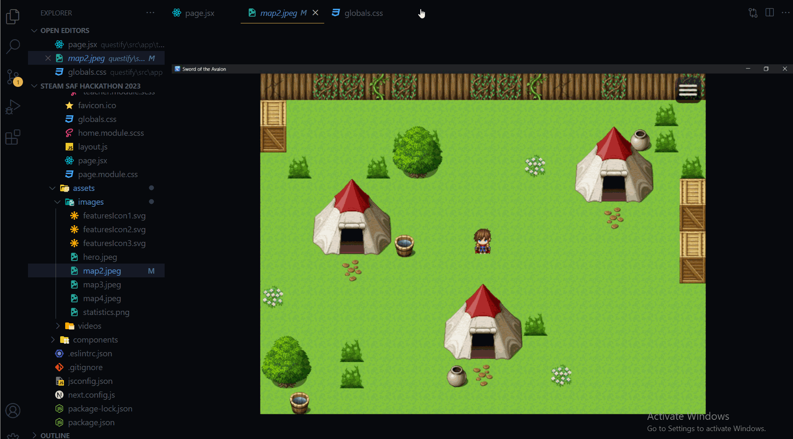

# ComfyFile

## Easy to use image converter in your VSCode
ComfyFile is an extension to comfortably convert images. You can convert various types of images in your VSCode without leaving your comfort zone. 

ComfyFile currently supports conversions between:
 - jpeg
 - png
 - svg
 - webp
 - tiff
 - gif
 - bmp
 
> Note: Planning to add support for other type of files as well in the future.

## How to Use It?
You can click **right-click to the image** you want to convert and choose `ComfyFile: Convert Image` command, then choose `ComfyFile: Convert Image` and choose your desired image type.

---

**In navigation**, the other way is to use `Ctrl + Shift + P` and search for `ComfyFile: Convert Image` and run the command. Choose your file from the window that opened and again choose `ComfyFile: Convert Image` and choose your desired image type.
